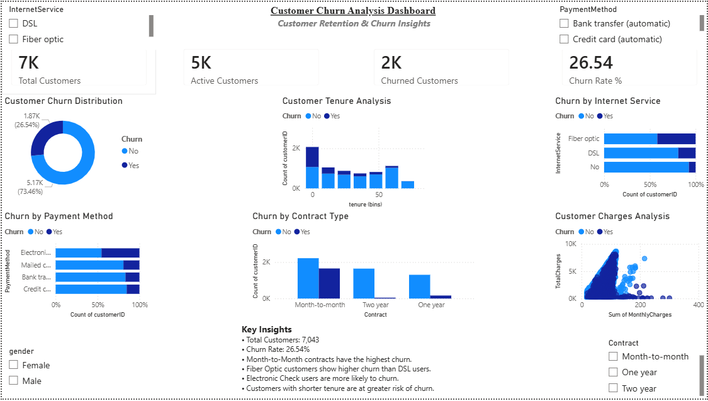

# Customer Churn Analysis Dashboard

## Dashboard Preview

## Overview

This project presents an interactive Power BI dashboard built using the IBM Telco Customer Churn dataset. The dashboard helps identify customer churn patterns by analyzing contract types, internet services, payment methods, customer tenure, and billing behavior.

## Tools Used

- Power BI
- Data Visualization
- Business Analytics

## Key KPIs

- Total Customers: 7,043
- Active Customers: 5,174
- Churned Customers: 1,869
- Churn Rate: 26.54%

## Key Insights

- Month-to-Month contracts have the highest churn.
- Fiber Optic customers show higher churn than DSL users.
- Electronic Check users are more likely to churn.
- Customers with shorter tenure are at greater risk of churn.

## Author

Akshansh Vijay
